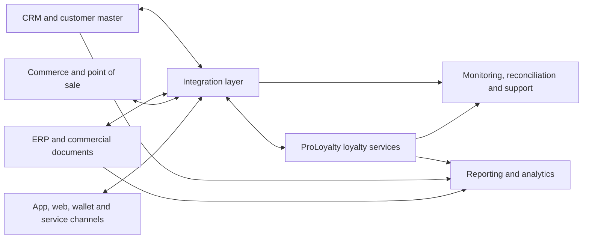
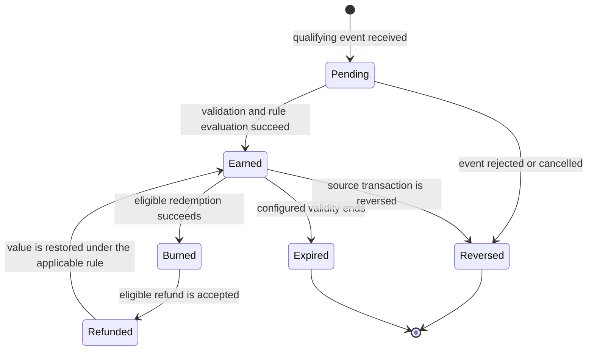

# Conceptual integration and lifecycle model

Status: non-confidential reference model; not a production API contract.

## System context

The diagram is intentionally technology-neutral. A project may implement the integration layer as direct REST calls, webhooks, Batch/SFTP, customer middleware or a combination. Direction and timing depend on the system of record and the required journey.

## Conceptual business domains

The following domains are an evaluation model, not a claim about exact production field names:

| Domain | Typical responsibility | Architecture question |
|---|---|---|
| Identity and membership | participant, organization, account, role and status | Which system owns identity and which system may change it? |
| Program and currency | program, tenant, brand and loyalty currency | How are brands, countries and programs separated? |
| Transaction and booking | purchase, qualifying event, booking and correction | Which identifier prevents a repeated delivery from creating a second booking? |
| Rules and campaigns | conditions, effects, time windows, budgets and exclusions | What may a business user configure and what requires development? |
| Benefit and reward | coupon, reward, order, entitlement and fulfillment status | Where is availability checked and how are reversals handled? |
| Consent and preference | purpose, channel, source, version and timestamp | How is a change propagated and audited across systems? |
| Operations | processing status, exception, retry and reconciliation result | Who owns detection, correction and customer communication? |

## Loyalty booking lifecycle

The lifecycle is conceptual. Whether a transition is automatic, manual, synchronous or asynchronous is defined in the project rulebook. Correction must preserve the relationship to the original business event and its processing history.

## Integration decision matrix

| Requirement | Suitable pattern | Mandatory acceptance evidence |
|---|---|---|
| immediate balance or eligibility response | synchronous REST interaction | request identity, timeout behavior, idempotency, error contract and load test |
| downstream notification after a loyalty event | webhook or event delivery | event catalog, delivery status, repeated-delivery behavior and receiver validation |
| high-volume or non-urgent transfer | Batch/SFTP | file contract, completeness control, restart behavior and reconciliation |
| heterogeneous enterprise landscape | customer or project integration layer | ownership, mapping, routing, monitoring and operational responsibility |
| migration or program exit | controlled export/import | data dictionary, counts, checksums, trial migration and signed acceptance |

## Golden path for an Earn booking

1. The source system creates a stable business-event identifier.
2. The integration layer validates structure, authorization context and required business references.
3. The loyalty service checks whether the event has already been processed.
4. Applicable program rules are evaluated.
5. The booking and resulting balance/state are recorded together with the source reference.
6. The response distinguishes accepted, already processed and rejected events.
7. Downstream notifications are emitted only for committed state changes.
8. Monitoring and reconciliation verify both technical delivery and business completeness.

## Failure and correction model

Transport retry does not replace business reconciliation. A robust operating model distinguishes:

- a request that never reached the receiving system;
- a committed request whose response was lost;
- a technically valid request rejected by a business rule;
- a delayed event received out of order;
- a duplicate delivery of the same business event;
- a later reversal, expiry or refund;
- an exception requiring an authorized manual correction.

For each class, the project must define ownership, visibility, customer impact, correction authority and audit evidence.

## Acceptance checklist

- system-of-record matrix approved;
- object and field mapping versioned;
- lifecycle and correction rules approved by business and finance owners;
- happy path, duplicate, timeout, reversal, expiry and refund tests passed;
- permissions and purpose limitation tested;
- load profile and operational thresholds agreed for the specific environment;
- monitoring, escalation and reconciliation responsibilities accepted;
- export and exit test completed;
- customer-specific details stored outside this public reference package.
